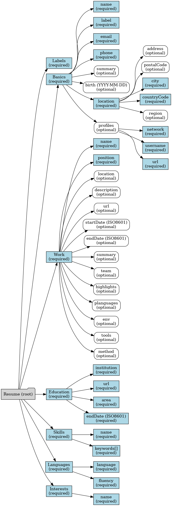

# JSON cv schema


This project provides a **JSON schema** for resumes that can be used with the external project CV_generator_from_JSON, and ensures that any JSON passed to it **conforms to the schema**.  
Validation is performed internally using [Zod](https://github.com/colinhacks/zod) to guarantee the correctness of the data.

---

## Installation

Requirements:
- **Node.js** v22 or higher
- **npm** v11 or higher

```bash
git clone --recurse-submodules https://github.com/corentinffoucault/json_cv_schema.git
cd json_cv_schema
npm ci
npm run build
``` 

---

## Legend

- :material-checkbox-marked:{ style="color:green" } **Required field**  
  This property must be present in the JSON.

- :material-checkbox-blank-outline:{ style="color:grey" } **Optional field**  
  This property can be omitted.

- :material-alert-circle:{ style="color:orange" } **Warning / Special rule**  
  Indicates constraints (e.g. date format, unique values, specific pattern).

---

## Purpose

The schema defines a structured and type-safe format for resumes, including:

- **labels**: Customizable names for each resume section  
  Useful for localization or adapting labels in your CV.  
  Includes:
  - ✅`works`: Label for the work experience section
  - ✅`planguages`: Label for programming languages
  - ✅`team`: Label for team information
  - ✅`tools`: Label for tools and frameworks
  - ✅`environment`: Label for the work environment
  - ✅`methods`: Label for methodologies
  - ✅`worksSkill`: Label for skills gained from work experience
  - ✅`diploma`: Label for education/diplomas
  - ✅`language`: Label for spoken languages
  - ✅`interests`: Label for hobbies and interests

- **basics**: Personal information  
  Contains core details about the candidate:
  - ✅`name`: Full name
  - ✅`label`: Professional title (e.g. *Software Engineer*)
  - ✅`email`: Email address (validated as a proper email format)
  - ✅`phone`: Phone number (string, free format)
  - ⬜`summary`: Short biography (2–3 sentences) 
  - ⬜`birth`: Date of birth (strict ISO date format `YYYY-MM-DD`)
  - ✅`location`: Structured address including:
    - ⬜`address`: Street and details (supports multiple lines)
    - ⬜`postalCode`: Postal/ZIP code
    - ✅`city`: City name
    - ✅`countryCode`: ISO-3166-1 Alpha-2 country code (e.g. *US, FR, DE…*)
    - ⬜`region`: Region, province, or state
  - ⬜`profiles`: List of social or professional networks (e.g. GitHub, LinkedIn):
    - ✅`network`: Platform name
    - ✅`username`: Profile username/handle
    - ✅`url`: Profile URL

- ✅**work**: Professional experience  
  Represents each work entry with:
  - ✅`name`: Company name
  - ⬜`location`: Company location
  - ⬜`description`: Short company description
  - ✅`position`: Job title
  - ⬜`url`: Company or job URL
  - ⬜`startDate` / `endDate`: ISO8601 dates (supports year-only or year-month)
  - ⬜`summary`: Responsibilities overview
  - ⬜`team`: Team details:
    - ✅`back`, ✅`front`, ✅`fullStack`: Number of developers by role
    - ✅`description`: Team methodology (e.g. *Scrum team*)
  - ⬜`highlights`: Accomplishments list
    - ✅`subject`: Main achievement
    - ⬜`cat`: Category (e.g. *project | studies*)
    - ⬜`alternative`: Simplified wording for lightweight CVs
    - ⬜`detail`: Detailed bullet points
  - ⬜`planguages`: List of programming languages used
  - ⬜`env`: Work environment (OS, cloud, etc.)
  - ⬜`tools`: Tools and frameworks
  - ⬜`method`: Methodologies used (Agile, Scrum, Kanban…)

- ✅**education**: Educational background  
  Each entry includes:
  - ✅`institution`: School or university
  - ✅`url`: Institution URL
  - ✅`area`: Field of study (e.g. *Computer Science*)
  - ✅`endDate`: Graduation date (ISO8601)

- ✅**skills**: Professional skills  
  Each skill entry includes:
  - ✅`name`: Skill category (e.g. *Web Development*)
  - ✅`keywords`: Related keywords (e.g. *HTML, CSS, JavaScript*)

- ✅**languages**: Spoken languages  
  Each entry includes:
  - ✅`language`: Language name (e.g. *English, Spanish…*)
  - ✅`fluency`: Fluency level (e.g. *Native, Fluent, Beginner*)

- ✅**interests**: Hobbies or personal interests  
  Each entry includes:
  - ✅`name`: Interest name (e.g. *Philosophy, Hiking, Open Source*)

The project ensures that any JSON resume **passed as input** matches this structure and respects required fields and patterns (like ISO 8601 date formats).

---

## Graph



---

## Usage

To validate a resume JSON:

```ts
import { validateResume } from "@your-org/json_resume_schema";

const myResumeJson = { /* your JSON here */ };
try {
Controler.isValidResume(resume); // throw if invalide
  console.log("Resume JSON is valid!");
} catch(e) {
    console.error(e.message());
}
```